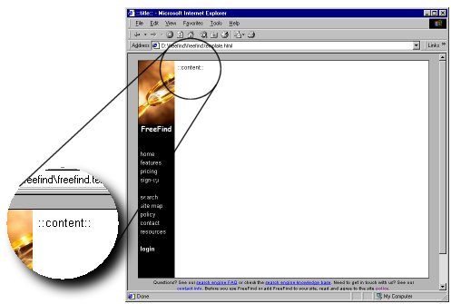
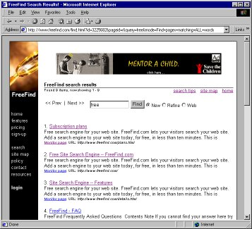
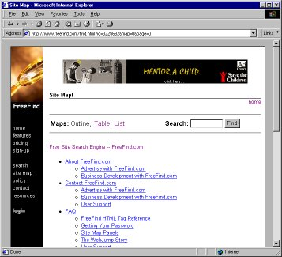

# How To Use Templates -- FreeFind.com

How To Use Templates

Templates allow you to "drop" the search results into a page of your own design. Using this mechanism your search results can look exactly like the rest of your site. This how-to describes how to use a "template" to customize the look of your search results.

This tutorial is not a web/html primer and assumes that you already know how the process of "web surfing" is accomplished (i.e. a browser requests a page from a server which then returns the page to be viewed), and what an HTML "form" is and how it works. If you are not familiar with these concepts please read a basic web/html primer.

What is a Template?

A template is a great way to customize the look of your search engine results pages. A template is simply an HTML page with special fields. The special fields tell FreeFind where to insert the page contents. This enables you to create a completely customized look and feel.

Who Should Use It?

Professionals and perfectionists! Using templates is more complex than the basic customization options, but if you are an experienced web developer who wants to control the look of the results precisely then this feature is for you.

Overview

Creating a template is easy. You just create a regular web page and then tell the search engine where to insert the page title and page contents (search results, site map, etc) by using simple text strings.

Once your template is finished you need to upload it to the FreeFind server. This is done using the [Control Center](https://freefind.com/control.html). After logging in, go to the  page and use the "upload custom template" option.

Both these steps are covered in more detail below.

Creating a Template

Usually the easiest way to create a template is to copy an existing page on your site then modify it for use as a template. You will need to make the following modifications:

Replace the page title with "::title::"

Remove the title of your page and replace it with the text `"::title::"` (without the quotes). This is the location the title text will be inserted before showing it to your visitors (for example, "Search Results", or "Site Map").

Replace the page content with "::content::"

Remove the content of your page (the "stuff" that make that page unique), and then add the text `"::content::"` (without the quotes) where you want your search results to be located. The search engine will insert the actual search results at that spot before displaying the page to your visitors.

Ensure there are no relative links

Since the page will be served from our domain, all of the links in your template need include your domain name, so they refer to your content and not ours. The easiest way to do this is to add a "base href" tag at the start of the `head` section. The href value should be the address of your site or address of the page which you based the template on. For example:

				<base href="https://example.com/">
			

To illustrate, here is what a template might look like:

Note the `"::content::"` text where the page content will be inserted. Using this template, FreeFind would create a search result page that looks like this:

When that same template is used to create a site map page it looks like this:

As you can see, a single template is used to generate more than one type of page.

Page Types

FreeFind serves up to six types of pages, depending on what features you are using. The same template is used for all six pages, so don't include page-specific items in your template. For example, the text "Search Results" would look a little strange on the Site Map page.

The search engine serves up to six types of pages, depending on what features you are using:

1.  _Site search, query page_ – a single site search panel. ([example](https://search.freefind.com/find.html?si=3225682&sbv=j2))
2.  _Site search, search results_ – the results of a site search. ([example](https://search.freefind.com/find.html?si=3225682&pageid=r&query=pricing&sbv=j2))
3.  _Web search, query page_ – a single web search panel. ([example](https://search.freefind.com/find.html?si=3225682&t=w&sbv=j2))
4.  _Web search, search results_ – the results of a web search. ([example](https://search.freefind.com/find.html?si=3225682&t=w&pageid=r&query=hosting&sbv=j2))
5.  _Site map_ – an overview of your site. ([example](https://search.freefind.com/find.html?si=3225682&m=0&p=0&sbv=j2))
6.  _What's new_ – a list of the recently changed pages on your site. ([example](https://search.freefind.com/find.html?si=3225682&w=0&p=0&sbv=j2))

You can customize the page titles and headings for each page type separately. To do this log in to the [Control Center](https://freefind.com/control.html) and go the to the  page. Then use the edit site search text, edit web search text, and edit site map text links.

Uploading your Template

After you have created your template you need to upload it to our servers. To do this log in to the [Control Center](https://freefind.com/control.html) then go the to the  page. In the middle of that page, click on the upload custom template link. A dialog will appear with a large text area into which you can paste your template code. After adding your code click on the Preview button to quickly get a rough idea of how your search results will look without committing to making the change. If you are satisfied with your template, use the Finish button to use the new template.

An Example Template

The following HTML code is a simple template. It creates a page with the headline "Example Template". Both the headline and the page contents are centered. The page background is gray and the text color is white;

<html><head>
  <base href="https://example.com">
  <title>::title::</title>
  
</head><body>
  

    <h2>Example Template</h2>
    

      ::content::
    

  

</body></html>

Template Restrictions

Summary

**Sponsored (free) accounts**  

-   [No advertising](#advertising) may be included in the template
-   [No link exchanges, CPA, Affiliate Programs](#advertising), etc. may be included
-   [No Pop-up windows](#pop) may be included in the template
-   [No including JS files](#js) by the template

**All accounts**  

-   [Relative links](#relative) or image URLs may not be used (they won't work!)
-   [Template size](#size) must be less than 64K bytes of HTML
-   [Scripting](#scripting) is limited to JavaScript

**No Advertising (free accounts only)**  

Templates for sponsored (free) accounts may not contain advertising, affiliate programs or link exchange banners. Subscription accounts are free to show advertising.

Due to our contractual obligations to our advertisers, free accounts must not include advertising in their template. _Doing so will result in account termination._ Of course, you're free to show advertising anywhere else on your site!

If you would like to include advertising in your template, please [subscribe](https://freefind.com/plans.html).

**No Pop-up Windows (free accounts only)**  

Templates may not include windows that pop-up automatically.

**No Including JS Files (free accounts only)**  

Templates may not include external javascript files. For example:

			
		

If you want to do this you must subscribe first.

**Relative Links**  

Because the pages are served from the FreeFind servers, all templates must contain a "base href" tag or all links and image tags must use "absolute" links (fully qualified URLs starting with `"http..."`) rather than relative links in order to work properly. Relative links will simply not work because they will refer to our server instead of yours. _This includes all types of links, including image links._

For example the image tag:

			
		

would not work. The tag must be written as:

			
		

to work.

Of course the same is true of HREFs:

			<a href="contact.html">
		

will not work. It should be written as:

			<a href="https://www.example.com/contact.html>
		

to work.

**Template Size**  

Templates are limited to 64K bytes of HTML. Note that this does _not_ include images. You may use as many images as you would like. The limit is only for the HTML part of the page template, not the entire size of the resulting page.

Common Questions

[Can I customize my page without templates?](#templates00)

Absolutely. It's fast and easy to customize your page without using templates. Templates simply give you more control. To customize without templates log in to the [Control Center](https://freefind.com/control.html) then go the to the  page.

[Can I customize elements within the `::content::` block?](#templates01)

Yes. In the  page all options are available except the ones in the "easy customization" section.

Additionally, you may [use CSS styles](https://freefind.com/library/howto/style/) to customize the look of the content.

[How do I use my own search box instead of the default one?](#templates02)

First, be sure your template contains a functioning search box of your own design.

Then, to hide the search box in the search results pages, add this line of code to the search box on your site:

				<input type="hidden" name="nsb" value="1">
			

**Note:** To have the current query merged into your search box so that it is displayed to the user, use the

				<!--cleanquery-->
			

merge point in your search box code. For example, your search input field might look like this:

				<input type="text" name="query" value="<!--cleanquery-->">
