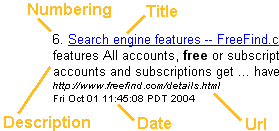

# Result Item Format -- FreeFind.com

Custom result item formats

A search results page is composed of one or more result items. By default the search engine places up to 10 result items on each result page. Each result item normally contains a number, title, description, and url. Optionally it can contain the date as well.

 For most web sites the standard result format, depicted to the right, is appropriate. Some web designers may wish to customize the format using the FreeFind Control Center.

Click on the  tab in the Control Center, then click the "Result item format" link to customize the result format.

The standard item format controls are you see in this dialog are documented [elsewhere](https://freefind.com/library/ref/cc/customize.html#resultoptions).

The documentation below is for advanced users and describes how to create a custom item format.

Item format

A custom item format is a a snippet of HTML that is used by the search engine when building the search results page. This piece of HTML defines the layout of a single search result item. You'll need to be comfortable working with HTML to use this feature.

Creating a custom item format is done by writing the HTML for a result item, using certain "insertion points" in place of parts of the HTML. At runtime these insertion points are replaced with the actual result data. Here's a quick example of a custom format:

Sample format

		(::number::) <a  href="::url::">::title::</a> 
		::description:: 
		<small><i>::displayurl::</i> 
		::date:: </small> 
	

Insertion points

the following insertion points apply to normal "page search" used by most sites

Insertion point

Is replaced at runtime with

::url::

The URL of the page referred to by this search result item. For use in your link tag href attribute.

::target::

Target attribute for your link - this is the target specified in the "Result link target" dialog on the "build index" page of the control center.

::title::

Title for use in the link to the search result. This is typically the <title> tag of the page this search result item links to, but may be the display url if the page has no title or you have selected this option in the control center.

::description::

Text snippet from the page this search result item refers to, usually showing the user's search results in context.

::displayurl::

A version of the page url (::url::) that may have been trimmed in size for display.

::date::

The last modified date of the page this search result refers to. Format and time zone for this date are set in the FreeFind Control Center.

::number::

Search result items are numbered starting with 1 for the first result item returned, 2 for the second, 3 for the third and so forth. When results are sorted by relevance, number 1 is the most relevant. When sorted by date, number 1 is the most recent.

::image::

You can include an image with each search result item. To use this custom image placement be sure to select "custom placement" in the Image Placement dialog (under the customize tab). You'll also need to select an image source, in the Image Sources dialog (also under the customize tab).

the following is the only insertion point for sites using "data search"

Insertion point

is replaced at runtime with

::resultdata::

The entire HTML of your data search item (data search sites only)
