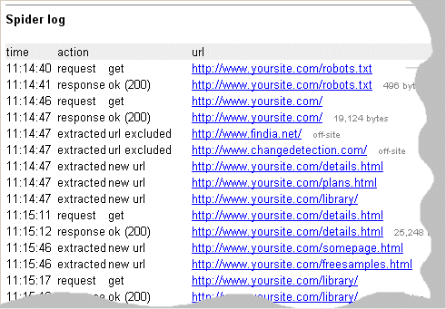
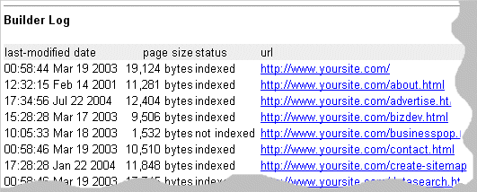

# Indexing Log File Reference -- FreeFind.com

Indexing log file reference

This reference describes the indexing log file that is created when we index your site. It covers each section of the log file and explains the messages that you might find in your log.

You can view your indexing log file by clicking on the "view log list" link under the "reports" tab in the FreeFind control center.

Overview

In order to build a searchable index of the content of your website we must first read every page of your website that is going to be included in the index. This is done by a system known as a "spider" (aka "crawler" or "bot"). This system works like a very patient person, browsing your site until it has visited every page. Once all relevant pages have been gathered a searchable index is built and is used when searching your site.

The spider starts by reading your home page and any additional "starting points" that you configured in the FreeFind control center. The spider then examines each of these pages for links to other pages. As it looks at each link the spider decides if the link is to another page on your site, a page on a different site, or if the link is unwanted for some other reason. After creating a list of the links that go to other pages on your site, the spider then reads those pages. This process repeats until the spider has read your entire website.

At each stage in the process the spider makes a note in the log file. You will find the spider section near the top of the log file.

When the spidering process is complete the pages that were found are passed to the builder. The builder looks at all of the pages read by the spider and creates the searchable index for your site. As the builder creates your index it notes each page in the builder section of your log file.

Log sections

Your indexing log file is broken into three main sections plus a section at the top that lets you know which settings were being used.

**Log sections** in your report:

-   [Settings](#settings) - the settings in use for this job
-   [Spider log](#spiderlog) - our spider's requests and your server's responses
-   [Spider summary](#summary) - number of bytes and pages read
-   [Builder log](#builderlog) - list of pages included in your search

Settings

Using the FreeFind control center you can set a number of parameters that control the spider's operation. The values of these settings at the time your spider job starts running are shown in the settings section of the indexing log. These settings include:

-   main url – your website's address (e.g. www.yoursite.com)
-   pdf indexing – indicates if Adobe PDF format files are to be indexed
-   authentication – enabled if indexing password protected areas of your site
-   additional starting points – places to start the process of reading your site
-   user excludes – urls that should not be included in your index
-   site subsections – how your site should be divided into subsections
-   url matching – rules used to determine if two URLs are "the same"

Spider log

As our spider reads pages from your site the spider generates a log. This log shows the requests the spider has sent to your web server and the responses your server has sent back. The spider also logs the first time it finds each new URL while reading your site.

Below is a sample from a spider log. Because our spider is polite the first request it makes to your server is for a file called "[robots.txt](https://freefind.com/library/howto/robots/)". If you don't have a robots.txt file, don't worry, that's ok. In the sample below the web server had a robots.txt file so it responded ok to our request (the second line of the log).

The third and forth line of the sample log show our spider asking for and receiving the home page of the website being indexed.

The next few lines show the spider finding URLs in the page it just read. The spider logs each URL and whether the newly found URL will be excluded from or added to the spider's list of URLs to read.

Once the spider has some URLs to read it starts asking your server for them one by one. As your web server returns each of your web pages the spider examines each page for more URLs to read. And so the process repeats until your entire site has been read.

Spider summary

Once the spider finishes reading your website the spider writes a summary into the indexing log. This summary contains of the number and type of pages the spider processed as well as the number of bytes read.

This summary includes:

-   html pages read – the number html pages read by the spider
-   text pages read – the number of text pages read by the spider
-   pdf pages read – the number of PDF files read and the number of pages they contained
-   total pages – total number of pages processed
-   page limit – your page limit, if any
-   total bytes – number of bytes in all documents combined

Builder log

After the spider has finished reading pages from your site they are passed to the index builder. The builder creates the searchable index of your site from the pages that the spider has read. As it builds your index the builder notes each page that is included in your final index. For each file that the builder sees it writes one line into the log file.

Each line contains the following information:

-   last modified date – date the document was last changed (if sent by your server)
-   page size – the number of bytes in this page
-   status – indicates if the page was included in your index, or not
-   URL – the URL (address) of the page

**Note:** Use the builder log to see which pages are included in your index.
