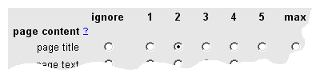

# Relevance Scoring Reference -- FreeFind.com

Relevance scoring reference

When the search engine returns the results of a user's query they are typically ordered by "relevance score" with the search engine placing first the document it believes to be most relevant.

You can also refine the relevance scoring for your website by using the relevance controls the the FreeFind control center.

Overview

There are two categories of relevance controls:

Page Relevance

The page relevance settings adjust how relevant each page or section of a website is relative to other pages.

For example, suppose your website had a section for current news and a section that is a news archive. If you wanted current news to come up earlier in a search than archived news, you could use the page relevance controls to lower the relevance of the news archive or boost the relevance of the current news section, or both.

Text Relevance

Text relevance settings adjust which parts of your page get indexed and how each part is weighted.

For example, you can specify how much weight the search engine should give to text which appears in the page title or body text or meta tags.

Additionally you can prevent parts of your page from being indexed. For example, sites that use the same title or meta tags on every page can easily prevent these from being indexed.

Page Relevance

_The following section describes the use of the Page Relevance dialog._

_You can find the dialog in the FreeFind control center by pressing the  tab and clicking on "page relevance"._

Page Relevance Rules

Normally the search engine determines the relevance score for a page automatically. Additionally you can fine-tune the relevance of specific pages or areas of your site using page relevance rules. To create a rule you enter a line of text (or "rule") in the Page Relevance dialog box, one rule per line. When determining which relevance rule to apply only the last matching rule is used.

The relevance rules works like this: the search engine calculates a page's relevance score for particular search request in its standard way, then it applies the relevance rule which raises or lowers the score in accordance with the percentage you specify.

A page that is not mentioned by any rule is defined to have a standard relevance of "100%". If you want some pages to have more relevance than usual you increase their scores by assigning a relevance value of more than 100%. If you want other pages to have less relevance than usual you assign them a relevance of less than 100%. You can assign values from 1% to 400%.

Rule Format

Each rule consists of a "URL mask" followed a relevance modifier.

The URL mask is simply a standard web address, but may contain the common wildcards "\*" and "?" to make it match more than one page on your site. The "\*" will match any number of any characters and the "?" will match any single character. Non-wildcard characters are matched without regard to case (case-insensitive).

URL masks which do not begin with "http://" are treated as if they begin with "\*".

The URL mask must be followed by a relevance modifier. A rule would look something like this:

		http://www.example.com/lastyear/\* relevance="50%"
	

The first part of the rule is the URL mask, the second part the relevance modifier. The rule above would match all URLs starting with http://www.example.com/lastyear/ and reduce their relevance to 50% of normal.

The relevance modifier is a percentage and must be between 1% and 400%. A relevance percentage over 100% boosts a page's relevance. A relevance percentage under 100% lowers a page's relevance.

For example to raise the relevance of a page you might use:

		relevance="120%"
	

or to lower a page's relevance you might use:

		relevance="50%"
	

When determining which relevance rule to apply only the last matching rule is used.

Examples

Example 1 - your website has a section for current news and a news archive. You want current news to tend to come up earlier in a search than archived news. You might use the following rules:

		http://www.example.com/news/\* relevance="120%"
		http://www.example.com/archive/\* relevance="50%"
	

In the example above, pages that are not in the /news/\* directory or the /archive/\* directory would receive the standard relevance of 100%.

Example 2 - your site has both PDF and HTML pages, but want the HTML pages to tend to rank higher in the search. You might use:

		\*.pdf relevance="75%"
	

This would give urls ending in .pdf a relevance of 75% while all other urls would receive the standard 100%.

**Note:** when using these rules you are changing the relevance of a set of pages by a certain percentage, not setting a specific result order. The final relevance score takes into account the specific query the user enters in addition to the relevance rules in this dialog.

Text Relevance

_The following section describes each control in the Text Relevance dialog._

_You can find the dialog in the FreeFind control center by pressing the  tab and clicking on "text relevance"._

Text Relevance controls which parts of a web page are indexed and their relative importance.

For each part of the page you can choose from a number of values running from "ignore" to "max". This controls the weighting or importance of each part of your HTML page.

Select ignore if a part of the page should not be indexed, or a weighting 1-5 (or max) for each part of the page you want indexed.

Page Content

Page Title

The `<title>` tag of your HTML page (shown at the top of your browser window)

Page Text

The visible text on the page (not including links, links have their own settings, below)

Page Url

the web address (http://...) of the web page.

Page Url Parts

if you are indexing page URLs, all or part of the URL may be indexed. Check the boxes of the parts of the URL you would like indexed.

HTML tags

Meta Description

The HTML `<meta>` description tag can be indexed or not. If you use the same meta description tag on every one of your pages you will want to set this to "ignore".

Meta Keyword

The HTML `<meta>` keyword tag can be indexed or not. If you use the same meta keyword tag on every one of your pages you will want to set this to "ignore".

FreeFind Keywords

If you are using the FreeFind keyword tag (see [HTML Tag Reference](https://freefind.com/library/ref/tagref/#fkwc)), you'll probably want to have it indexed. Select a weighting.

Images

While FreeFind does not index images, you can choose to have the `alt` attribute of your `` tags, or your image `src` url included in your index. The image files themselves will not be included in your index.

**Note:** If you want to display images in your search results, see [How to Use Images](https://freefind.com/library/howto/imagesource/).

Image Alt

The text in the `alt` attribute of an  tag. For example, in the image tag:

		          		
		          	

the text "beach front hotel" would be indexed.

Image URL

The URL that is in the image tag. In the example above it would be:

						http://example.com/img/hotel.jpg
					

Image URL parts

If you are indexing image URLs all or part of the URL may be indexed. Check the boxes of the parts of the URL you would like indexed. In the above example the domain is `"example.com"` the path is `"img"` the file is `"hotel.jpg"` and there is no query string.

Special features

In addition to which part of a page a word is found in, the search engine can also take into account the position of a word and the size of the document.

Use position in file

If enabled text found earlier in the page text will be weighted more than words at the end of the document. Words found in non-visible text will be weighted as if they appear in the middle of the document.

Use word density

If enabled text relevance is adjusted for the total number of words in the document, helping to prevent large documents with many repetitions of keywords from crowding out smaller documents in the results.

Linked text handling

Linked text is text that forms a hypertext link. For example in the link:

						<a href="page.html">a great page</a>
					

the text "a great page" would be considered the link text.

Link text is divided into two types: internal links and external links. Internal links are links from one page of your site to another page of your site. External links are links to pages not on your site (or more properly, pages not included in your index).

_Internal links_ are relevant to both the page they are on and the page they point to. You can adjust the relevance of each of these separately.

Page link is on

This control adjusts the relevance to the page on which the link appears.

Page link points to

This control adjusts the relevance to the page you get to when clicking on the link.

_External links_ are only relevant to the page they are on (because, by definition, the page they point to is not included in your index).

External links

Relevance to the page upon which the link text appears.
